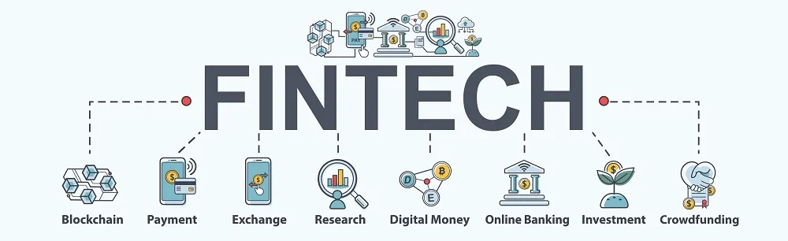

# read_me_activity
For practicing writing README.md files
# *FinTech Repsoitory level 1*
## FinTech Respository level 2
### FinTech Repository level 3

---
**Welcome to my repository! Please explore the code base.**\

> "...to boldly go where no one has gone before."

A `print` function in Python prints the desired text in output:
```python
text = ‘This is a sentence that you would like to display.’
print(text)
```

## Directory
[Programs](code)

[Data Files](data)

[References](references)
